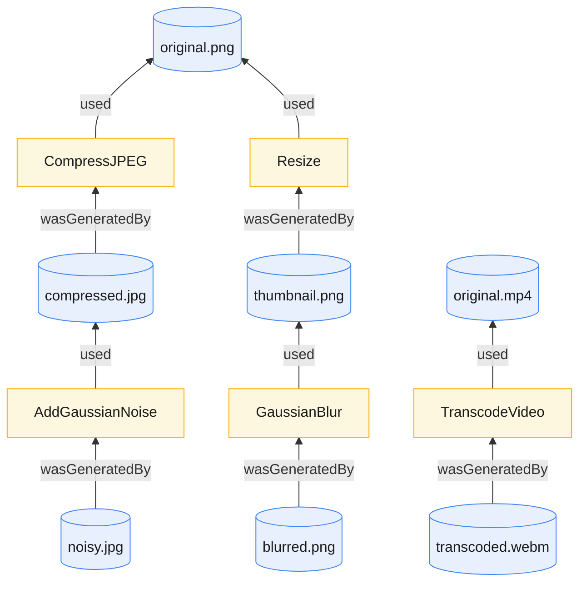
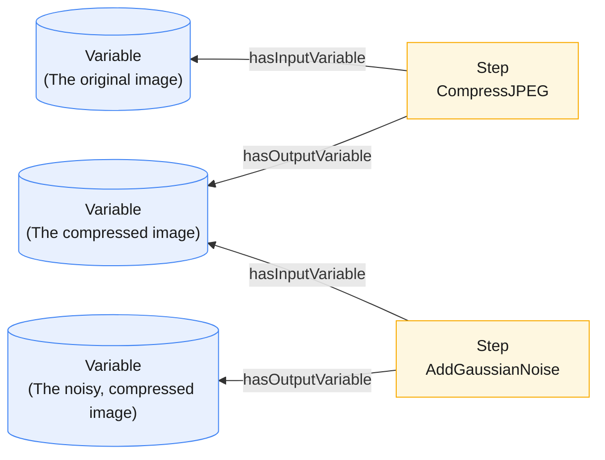

# Tamper

[](https://github.com/jlocash/tamper/actions/workflows/ci.yml)

## Requirements

- Python 3.14+
- [`uv`](https://docs.astral.sh/uv/) for dependency management
- System packages `ffmpeg` (video/audio probing and transcoding) and `libmagic` (MIME-type detection)

## MCP Server

The Tamper MCP server is the recommended way to use Tamper.

### Install dependencies

```shell
# Initialize the environment
uv venv
source .venv/bin/activate

# Install dependencies
uv sync
uv pip install -e .
```

### Run directly

```shell
# Define the directory where tamper will store our RDF dataset and generated media
export TAMPER_HOME=$HOME/.tamper

# Run the MCP server (uses fastmcp.json)
fastmcp run
```

Tamper is a framework for describing multimedia assets and the media operations that transform them. Its primary
audience is those working with media datasets and want to run progressive manipulations on them.

First, Tamper expresses media assets and operations as entities and activities in a provenance chain:



## Making sense of your data

Media assets are the core _things_ being tracked. They are related to each other through media operations. This means
that if one image is related to another, then they are connected through provenance relationships (e.g _wasGeneratedBy_,
_used_).

Media operations are the processes that _transform_ media assets. For example, If I compress an image, Tamper treats the
result as an entirely new image, related back to the original via the "compress" operation.

When managing thousands of media assets and running operations on them, this complexity becomes incredibly difficult to
manage. Tamper solves this by encoding these relationships directly in a semantic knowledge graph.

**Why RDF?**

1. Tamper uses RDF because other models simply aren't expressive enough to capture these highly-intricate, often nested
   relationships. A graph model is just the right one for this use case.
2. SPARQL (the query language for RDF graphs) is highly expressive and allows for query media assets of all types. By
   traversing paths in a graph, Tamper can avoid the overhead of nested joins that would plague a relational model
3. Tamper also uses OWL to define its vocabulary (arguably its core element), which assumes an "open world" and allows
   for a level of modularity that property graphs lack. This means you can integrate tamper into your own RDF datasets,
   or even define your own operation types (coming soon!)

### Generating new data (the actual tampering):

Tamper is capable of executing several common degradation/tampering operations on media. This includes operations such
as JPEG compression for images, adding noise, or transcoding video. See the operations documentation for a complete list
of supported operations (more are constantly being added!).

To mutate Tamper's knowledge graph, you submit an **Operation Plan**. These plans act like blueprints for describing new
branches in the knowledge graph that you want to create. They are directed acyclic graphs (DAGs) whose 'steps' are media
operations and whose 'variables' are media assets. You hand Tamper a plan, point it at the media assets it needs start
executing it, and it will materialize new branches in the knowledge graph. Because plans are DAGs, they can have as many
branches as you'd like. Tamper executes each step as a [Ray](https://github.com/ray-project/ray) task under the hood,
which means plan execution is highly parallelized!

### What if I'm not familiar with RDF?

Not a problem! Tamper provides an MCP server which lets your favorite AI agent generate operation plans and queries for
you! This also means you can let Tamper manage the complexity in your data, and query out the CSV, JSON or other data
formats you need to do actual work.

See also: [RDF 1.1 Primer](https://www.w3.org/TR/rdf11-primer/)

## The Data Model

Every file is described as an **asset** with a content-addressed identifier
(`asset://<sha256>` — derived from the file's contents, so the same bytes always
get the same id), its media type, and technical metadata. Here's a PNG image:

```turtle

@prefix tamper: <https://example.org/tamper/core#> .

<asset://aad96d410d92b5589d41e8462507e3af57682022db3d3711a236c0245fcf296e> a tamper:ImageAsset ;
    tamper:checksum "sha256:aad96d410d92b5589d41e8462507e3af57682022db3d3711a236c0245fcf296e" ;
    tamper:height 566 ;
    tamper:mediaType "image/png" ;
    tamper:pixelFormat "PNG" ;
    tamper:width 850 ;
    prov:wasGeneratedBy <operation://d96bbc20-016c-4fb8-9e84-cb9299646c8b> .

<operation://d96bbc20-016c-4fb8-9e84-cb9299646c8b> a tamper:CompressImage ;
    prov:endedAtTime "2026-05-23T16:51:08.113923"^^xsd:dateTime ;
    prov:startedAtTime "2026-05-23T16:51:08.097677"^^xsd:dateTime ;
    prov:used "asset://45f0867c530cdb68df8d0a38e49f8d7084b0d2bf1a056570751dcdfca24777d6" ;
    tamper:qualityFactor "80"^^xsd:nonNegativeInteger .
```

Read top to bottom, that says: _this asset is an image; its checksum is …; it's
566 pixels tall; its media type is `image/png`; it's 850 pixels wide._
See [the data model reference](docs/data-model.md) for audio and video examples.

## Operation Plans

To mutate the graph, you submit an **operation plan**: a blueprint for the new
branches you want to grow from existing assets. Think of it as a recipe with two
kinds of ingredient:

- **Variables** — placeholders for the assets that flow through the plan (the
  input you start with, and each intermediate and final result).
- **Steps** — the operations that consume one variable and produce another
  (compress this, then blur that).

You create an operation plan, hand it to Tamper along with the assets needed to start executing it, and Tamper will
execute the plan and materialize the results as new branches in the graph.

Wired together, the steps and variables form a directed graph. Tamper executes
it in dependency order: as soon as a step's input variable is ready, it runs concurrently with every other ready step (
via [Ray](https://www.ray.io/)).



### Creating and Executing a Plan

Plans are written in RDF using the `plan:` vocabulary. Each step points at a
`plan:OperationParameters` bundle that names the `tamper:` operation to run and
its parameters. See [the operations reference](docs/operations.md) for a complete list of supported operations.

The plan below has three variables (`v0` → `v1` → `v2`) and two steps: step `s1`
compresses the input image, then step `s2` adds Gaussian noise to the result. Step `s2`'s input variable is the output
of `s1`, chaining them together.

```turtle

@prefix plan:   <https://example.org/tamper/plan#> .
@prefix tamper: <https://example.org/tamper/core#> .
@prefix rdfs:   <http://www.w3.org/2000/01/rdf-schema#> .

<plan://example> a plan:OperationPlan .

# Variables (each bound to a media asset at execution time)
<plan://v0> a plan:Variable ;
    plan:isVariableOfPlan <plan://example> ;
    rdfs:label "The original image" .

<plan://v1> a plan:Variable ;
    plan:isVariableOfPlan <plan://example> ;
    rdfs:label "The compressed image" .

<plan://v2> a plan:Variable ;
    plan:isVariableOfPlan <plan://example> ;
    rdfs:label "The noisy, compressed image" .

# Steps (media operations)
<plan://s1> a plan:Step ;
    plan:isStepOfPlan <plan://example> ;
    plan:hasInputVariable <plan://v0> ;
    plan:hasOutputVariable <plan://v1> ;
    plan:operationParameters [
        a plan:OperationParameters ;
        plan:operationType tamper:CompressJPEG ;
        tamper:qualityFactor 90
    ] .

<plan://s2> a plan:Step ;
    plan:isStepOfPlan <plan://example> ;
    plan:hasInputVariable <plan://v1> ;
    plan:hasOutputVariable <plan://v2> ;
    plan:operationParameters [
        a plan:OperationParameters ;
        plan:operationType tamper:AddGaussianNoise ;
        tamper:gaussianMean 0.0 ;
        tamper:gaussianStd 12.0
    ] .
```

Execute the plan, binding its input variable (`plan://v0`) to a real asset:

```python
import ray
from rdflib import Graph, URIRef

from tamper.assets import build_asset_from_file
from tamper.plans import OperationPlanExecutor, validate_plan_graph

# Parse and shape-validate the plan
plan_graph = Graph()
plan_graph.parse("plan.ttl", format="turtle")
validate_plan_graph(plan_graph)  # raises GraphValidationError on a malformed plan

# Seed a result graph with the input asset and bind it to plan://v0
seed_graph = Graph()
input_asset = build_asset_from_file(seed_graph, "input.png")

# Run the plan; generated files land in ./out, new statements are returned
ray.init()
executor = OperationPlanExecutor(plan_graph, seed_graph)
result = executor.execute(
    out_dir="./out",
    initial_variables={URIRef("plan://v0"): input_asset},
)
print(result.serialize(format="turtle"))
```

Every generated asset is linked to the operation that produced it via PROV (`prov:wasGeneratedBy`, `prov:used`), so the
result graph records the full derivation history.
