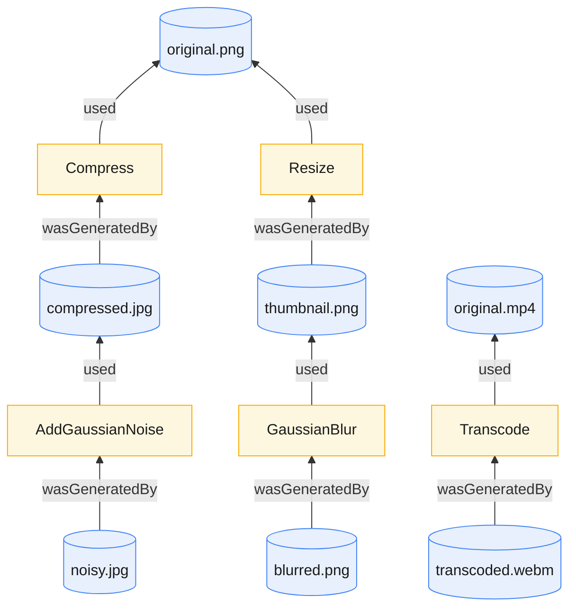
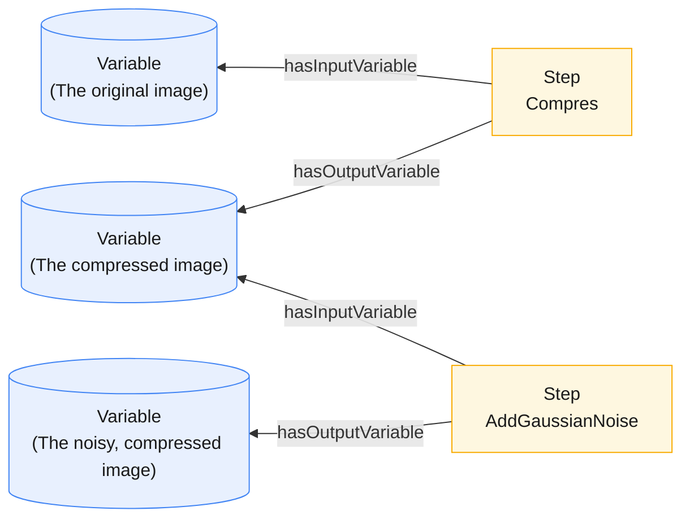

# Tamper

[](https://github.com/jlocash/tamper/actions/workflows/ci.yml)
[](LICENSE)
[](https://www.python.org/)

> Run degradation operations on media files (compression, blur, 
> noise, transcoding etc), and record every input,
> operation, and output as a queryable RDF provenance graph.


## Overview

Tamper is a framework for describing multimedia assets and the media operations
that transform them. It works by recording media assets as provenance entities 
and operations as activities. Together, they form provenance chains that are
semantically queryable. These chains form the basis of Tamper datasets.



## Installation

### Requirements

- **Python 3.14+**
- [`uv`](https://docs.astral.sh/uv/) for dependency management
- System packages `ffmpeg` (video/audio probing and transcoding) and `libmagic`
  (MIME-type detection)

### Install dependencies

```shell
# Initialize the environment
uv venv
source .venv/bin/activate

# Install dependencies
uv sync
uv pip install -e .
```

## Usage

### MCP server

The Tamper MCP server is the recommended way to use Tamper. It exposes tools and
vocabularies so an AI agent (or any MCP client) can track assets, author
operation plans, run them, and query the resulting graph.


```shell
# Run the MCP server (uses fastmcp.json)
fastmcp run
```

`fastmcp.json` configures the server to listen over HTTP on `0.0.0.0:8000`
and sets `TAMPER_HOME` to `~/.tamper` by default. This directory is where Tamper will store operation plans, media assets, and the RDF dataset.


### Using the core library

There is a set of core classes available for interfacing with the graph.
Each class instance is mapped to a resource in the graph:

```python
from tamper.core import ImageAsset, load_asset_from_file
from tamper.ops.image import Compress
from rdflib import Graph, BNode

# All of our data lives in a graph
ctx = Graph()

# Load an image asset
img_asset = ImageAsset.from_file(ctx, "some-image.png")

# Load an audio asset
audio_asset = AudioAsset.from_file(ctx, "some-audio.wav")

# Load a video asset
video_asset = VideoAsset.from_file(ctx, "some-video.mp4")

# Run an operation on the image
op = Compress.new(ctx, BNode())
op.format = "jpeg"
op.quality_factor = 90          # compress with quality 90
op.used(img)                    # uses the image asset

# Generate the compressed image and save it in /media 
op.mutate(out_dir="/media")
```


### The data model

Every file is described as an **asset** with a content-addressed identifier
(`trn:asset:<sha256>`, derived from the file's contents, so identical bytes always
get the same id, media type, and technical metadata. Here is a PNG image
and the operation that produced it:

```turtle
@prefix tamper: <https://example.org/tamper/core#> .
@prefix prov: <http://www.w3.org/ns/prov#> .

<trn:asset:aad96d410d92b5589d41e8462507e3af57682022db3d3711a236c0245fcf296e> a tamper:ImageAsset ;
    tamper:checksum "sha256:aad96d410d92b5589d41e8462507e3af57682022db3d3711a236c0245fcf296e" ;
    tamper:height 566 ;
    tamper:mediaType "image/png" ;
    tamper:pixelFormat "PNG" ;
    tamper:width 850 ;
    prov:wasGeneratedBy <trn:operation:tknRPmvjBrB4sms5> .

<trn:operation:tknRPmvjBrB4sms5> a tamper:Compress ;
    prov:endedAtTime "2026-05-23T16:51:08.113923"^^xsd:dateTime ;
    prov:startedAtTime "2026-05-23T16:51:08.097677"^^xsd:dateTime ;
    prov:used trn:asset:45f0867c530cdb68df8d0a38e49f8d7084b0d2bf1a056570751dcdfca24777d6 ;
    tamper:format "jpeg" ;
    tamper:qualityFactor "80"^^xsd:nonNegativeInteger .
```

See the [data model reference](docs/data-model.md) for image, audio, and video
examples.

### Available operations

See the [operations reference](docs/operations.md) for the full list of
supported operations with their parameters and value ranges.

### Operation plans

To mutate the graph, you submit an **operation plan**: a description of the new
assets you want to derive from existing ones. A plan has two parts:

- **Variables** — placeholders for the assets that flow through the plan (the
  input you start with, plus each intermediate and final result).
- **Steps** — the media operations that consume one variable and produce another.

Together, the steps and variables form a directed acyclic graph (DAG). Tamper executes
it in dependency order: as soon as a step's input variable is ready, it runs
concurrently with every other ready step (via [Ray](https://www.ray.io/)).



Plans are written in RDF using the `plan:` vocabulary. Each step points at a
`plan:parameters` bundle that names the `tamper:` operation to run and
its parameters. The plan below has three variables (`v0` → `v1` → `v2`) and two
steps: step `s1` compresses the input image, then step `s2` adds Gaussian noise
to the result.

```turtle
@prefix plan:   <https://example.org/tamper/plan#> .
@prefix tamper: <https://example.org/tamper/core#> .
@prefix rdfs:   <http://www.w3.org/2000/01/rdf-schema#> .

<trn:plan:example> a plan:OperationPlan .

# Variables (each bound to a media asset at execution time)
<trn:plan:example:v0> a plan:Variable ;
    plan:isVariableOfPlan <trn:plan:example> ;
    rdfs:label "The original image" .

<trn:plan:example:v1> a plan:Variable ;
    plan:isVariableOfPlan <trn:plan:example> ;
    rdfs:label "The compressed image" .

<trn:plan:example:v2> a plan:Variable ;
    plan:isVariableOfPlan <trn:plan:example> ;
    rdfs:label "The noisy, compressed image" .

# Steps (media operations)
<trn:plan:example:s1> a plan:Step ;
    plan:isStepOfPlan <trn:plan:example> ;
    plan:hasInputVariable <trn:plan:example:v0> ;
    plan:hasOutputVariable <trn:plan:example:v1> ;
    plan:operationType tamper:Compress ;
    plan:parameters [        
        tamper:format "jpeg" ;
        tamper:qualityFactor 90
    ] .

<trn:plan:example:s2> a plan:Step ;
    plan:isStepOfPlan <trn:plan:example> ;
    plan:hasInputVariable <trn:plan:example:v1> ;
    plan:hasOutputVariable <trn:plan:example:v2> ;
    plan:operationType tamper:AddGaussianNoise ;
    plan:parameters [        
        tamper:gaussianMean 0.0 ;
        tamper:gaussianStd 12.0
    ] .
```

With the MCP server running, hand the plan to your agent and bind its input
variable (`trn:plan:example:v0`) to a tracked asset. Every generated asset is linked to
the operation that produced it via PROV (`prov:wasGeneratedBy`, `prov:used`), so
the resulting graph records the full derivation history.


### MCP tools

The server exposes the following tools to an MCP client:

| Tool                | Purpose                                                                                          |
| ------------------- | ------------------------------------------------------------------------------------------------ |
| `InspectCatalog`    | Return the catalog graph listing all available datasets.                                         |
| `ExportCatalog`     | Export the entire catalog and all referenced media files to a tarball.                           |
| `CreateDataset`     | Create a new named dataset with a title and description.                                         |
| `DescribeDataset`   | Retrieve top-level metadata about a dataset.                                                     |
| `GetDatasetGraph`   | Return the full RDF graph of a dataset's contents.                                     |
| `LoadMediaAsset`    | Load an asset file into a dataset.                                   |
| `CreatePlan`        | Saves an operation plan for later use.                                    |
| `ListPlans`         | List saved plans.                                                                                |
| `GetPlan`           | Retrieve a saved plan's graph.                                                           |
| `DeletePlan`        | Delete a saved plan by name.                                                                     |
| `SubmitPlan`        | Submit a plan for async execution against a dataset.              |
| `QuerySPARQL`       | Run a read-only SPARQL `SELECT`/`ASK`/`CONSTRUCT`/`DESCRIBE` against the graph.                  |

### MCP resources

Vocabularies are served as MCP resources so an agent can fetch them before
writing plans or queries:

| Resource URI               | Contents                                              |
| -------------------------- | ----------------------------------------------------- |
| `vocabulary://tamper/core` | The Tamper core ontology (asset and operation terms). |
| `vocabulary://tamper/plan` | The Tamper plan vocabulary (steps and variables).     |
| `vocabulary://prov-o`      | The PROV-O ontology (provenance relationships).       |

