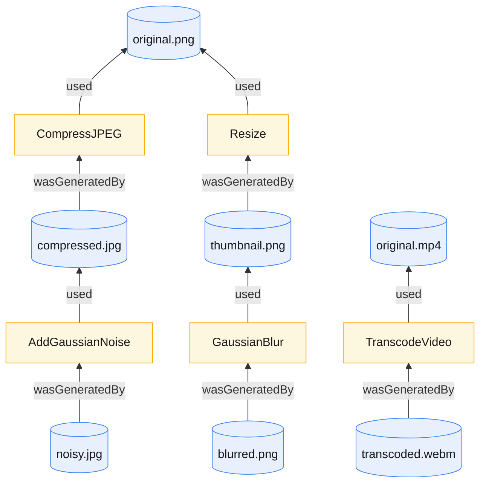
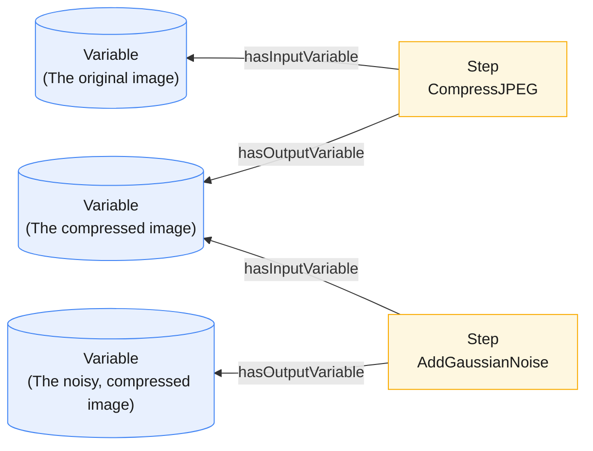

# Tamper

[](https://github.com/jlocash/tamper/actions/workflows/ci.yml)
[](LICENSE)
[](https://www.python.org/)

> Take your media files, run degradation/tampering operations on them (JPEG
> compression, blur, noise, video transcoding, …), and record every input,
> operation, and output as a queryable RDF provenance graph.

## Highlights

- **Media operations** — Compression, resizing, filtering, transcoding and [more](docs/operations.md).
- **Provenance tracking** — each generated file is linked to the operation and
  source it derived from via [PROV-O](https://www.w3.org/TR/prov-o/), so the
  graph records the full derivation history.
- **Operation plans** — define a DAG of operations once and run it over a set of
  assets. Steps execute in dependency order, concurrently where possible, via
  [Ray](https://www.ray.io/).
- **SPARQL queries** — select assets by lineage, metadata, or the operations
  that produced them.
- **MCP server** — exposes tools and vocabularies so an MCP client or agent can
  author plans and queries without prior RDF knowledge.
- **Docs:** [RDF primer](docs/rdf-primer.md) ·
  [Data Model](docs/data-model.md) · [Operations](docs/operations.md)

## Overview

Tamper is a framework for describing multimedia assets and the media operations
that transform them. It is built for people who work with media datasets and
want to run progressive manipulations over them while keeping track of exactly
how every output was produced.

Media assets are the core _things_ Tamper tracks, and media operations are the
processes that _transform_ them. When you compress an image, Tamper treats the
result as an entirely new asset, related back to the original through the
"compress" operation. When you are managing thousands of assets and running many
combinations of operations, that web of relationships becomes very hard to
manage. Tamper solves this by encoding the relationships directly in a semantic
knowledge graph using RDF, so the lineage of any asset is always one query away.



### Why RDF?

1. **Expressiveness.** Provenance relationships are deeply nested, and a graph
   model represents them directly rather than forcing them into rows and
   foreign keys.
2. **Querying.** SPARQL traverses these relationships as paths through the
   graph, avoiding the nested joins a relational schema would require.
3. **Modularity.** Tamper defines its vocabulary in OWL, which assumes an open
   world. You can integrate Tamper into your own RDF datasets, or define your
   own operation types (planned).

New to RDF? You don't need to know it to use Tamper — the MCP server lets an AI
agent handle it. For a short introduction, start with the
[RDF primer](docs/rdf-primer.md).

## Usage

The Tamper MCP server is the recommended way to use Tamper. It exposes tools and
vocabularies so an AI agent (or any MCP client) can track assets, author
operation plans, run them, and query the resulting graph. See
[Installation](#installation) to get the server running first.

### The data model

Every file is described as an **asset** with a content-addressed identifier
(`asset://<sha256>`, derived from the file's contents, so identical bytes always
get the same id, media type, and technical metadata. Here is a PNG image
and the operation that produced it:

```turtle
@prefix tamper: <https://example.org/tamper/core#> .

<asset://aad96d410d92b5589d41e8462507e3af57682022db3d3711a236c0245fcf296e> a tamper:ImageAsset ;
    tamper:checksum "sha256:aad96d410d92b5589d41e8462507e3af57682022db3d3711a236c0245fcf296e" ;
    tamper:height 566 ;
    tamper:mediaType "image/png" ;
    tamper:pixelFormat "PNG" ;
    tamper:width 850 ;
    prov:wasGeneratedBy <operation://d96bbc20-016c-4fb8-9e84-cb9299646c8b> .

<operation://d96bbc20-016c-4fb8-9e84-cb9299646c8b> a tamper:CompressJPEG ;
    prov:endedAtTime "2026-05-23T16:51:08.113923"^^xsd:dateTime ;
    prov:startedAtTime "2026-05-23T16:51:08.097677"^^xsd:dateTime ;
    prov:used "asset://45f0867c530cdb68df8d0a38e49f8d7084b0d2bf1a056570751dcdfca24777d6" ;
    tamper:qualityFactor "80"^^xsd:nonNegativeInteger .
```

See the [data model reference](docs/data-model.md) for image, audio, and video
examples.

### Available operations

See the [operations reference](docs/operations.md) for the full list of
supported operations with their parameters and value ranges.

### Operation plans

To mutate the graph, you submit an **operation plan**: a description of the new
assets you want to derive from existing ones. A plan has two parts:

- **Variables** — placeholders for the assets that flow through the plan (the
  input you start with, plus each intermediate and final result).
- **Steps** — the media operations that consume one variable and produce another.

Together, the steps and variables form a directed acyclic graph (DAG). Tamper executes
it in dependency order: as soon as a step's input variable is ready, it runs
concurrently with every other ready step (via [Ray](https://www.ray.io/)).



Plans are written in RDF using the `plan:` vocabulary. Each step points at a
`plan:OperationParameters` bundle that names the `tamper:` operation to run and
its parameters. The plan below has three variables (`v0` → `v1` → `v2`) and two
steps: step `s1` compresses the input image, then step `s2` adds Gaussian noise
to the result.

```turtle
@prefix plan:   <https://example.org/tamper/plan#> .
@prefix tamper: <https://example.org/tamper/core#> .
@prefix rdfs:   <http://www.w3.org/2000/01/rdf-schema#> .

<plan://example> a plan:OperationPlan .

# Variables (each bound to a media asset at execution time)
<plan://v0> a plan:Variable ;
    plan:isVariableOfPlan <plan://example> ;
    rdfs:label "The original image" .

<plan://v1> a plan:Variable ;
    plan:isVariableOfPlan <plan://example> ;
    rdfs:label "The compressed image" .

<plan://v2> a plan:Variable ;
    plan:isVariableOfPlan <plan://example> ;
    rdfs:label "The noisy, compressed image" .

# Steps (media operations)
<plan://s1> a plan:Step ;
    plan:isStepOfPlan <plan://example> ;
    plan:hasInputVariable <plan://v0> ;
    plan:hasOutputVariable <plan://v1> ;
    plan:operationParameters [
        a plan:OperationParameters ;
        plan:operationType tamper:CompressJPEG ;
        tamper:qualityFactor 90
    ] .

<plan://s2> a plan:Step ;
    plan:isStepOfPlan <plan://example> ;
    plan:hasInputVariable <plan://v1> ;
    plan:hasOutputVariable <plan://v2> ;
    plan:operationParameters [
        a plan:OperationParameters ;
        plan:operationType tamper:AddGaussianNoise ;
        tamper:gaussianMean 0.0 ;
        tamper:gaussianStd 12.0
    ] .
```

With the MCP server running, hand the plan to your agent and bind its input
variable (`plan://v0`) to a tracked asset. Every generated asset is linked to
the operation that produced it via PROV (`prov:wasGeneratedBy`, `prov:used`), so
the resulting graph records the full derivation history.

> **Prefer Python?** You can also drive a plan directly with
> `tamper.plans.OperationPlanExecutor` and `validate_plan_graph`. See the
> [operations reference](docs/operations.md) for the full API.

### MCP tools

The server exposes the following tools to an MCP client:

| Tool                     | Purpose                                                                                |
| ------------------------ | -------------------------------------------------------------------------------------- |
| `track_media_asset`      | Hash a file, extract its metadata, and add it to the knowledge graph.                  |
| `create_plan`            | Validate an operation plan (Turtle) and save it under a name.                          |
| `list_plans`             | List saved plans with their name, URI, step count, label, and description.             |
| `get_plan`               | Return a saved plan's graph in Turtle.                                                 |
| `delete_plan`            | Delete a saved plan by name.                                                           |
| `execute_operation_plan` | Run a plan, binding its input variables to tracked assets, and materialize new assets. |
| `sparql_query`           | Run a read-only SPARQL `SELECT`/`ASK`/`CONSTRUCT`/`DESCRIBE` against the graph.        |
| `sparql_update`          | Run a SPARQL update against the graph.                                                 |
| `export_dataset`         | Export the dataset and all referenced media files to a tarball.                        |

### MCP resources

Vocabularies are served as MCP resources so an agent can fetch them before
writing plans or queries:

| Resource URI               | Contents                                              |
| -------------------------- | ----------------------------------------------------- |
| `vocabulary://tamper/core` | The Tamper core ontology (asset and operation terms). |
| `vocabulary://tamper/plan` | The Tamper plan vocabulary (steps and variables).     |
| `vocabulary://prov-o`      | The PROV-O ontology (provenance relationships).       |

## Installation

### Requirements

- **Python 3.14+**
- [`uv`](https://docs.astral.sh/uv/) for dependency management
- System packages `ffmpeg` (video/audio probing and transcoding) and `libmagic`
  (MIME-type detection)

### Install dependencies

```shell
# Initialize the environment
uv venv
source .venv/bin/activate

# Install dependencies
uv sync
uv pip install -e .
```

### Run the MCP server

```shell
# Run the MCP server (uses fastmcp.json)
fastmcp run
```

`fastmcp.json` configures the server to listen over **HTTP on `0.0.0.0:8000`**
and sets `TAMPER_HOME` to `$HOME/.tamper` by default. On startup Tamper creates
`TAMPER_HOME/` (and a `TAMPER_HOME/plans/` subdirectory) and stores the dataset
at `TAMPER_HOME/dataset.trig`. Point your MCP client at the running HTTP
endpoint to connect.

## Feedback & Contributing

Bug reports, feature requests, and questions about the data model are welcome —
please [open an issue](https://github.com/jlocash/tamper/issues) on GitHub.
Contributions of code, documentation, and new operation types are also welcome.

## License

Released under the [MIT License](LICENSE). Copyright (c) 2026 Joshua Locash.
